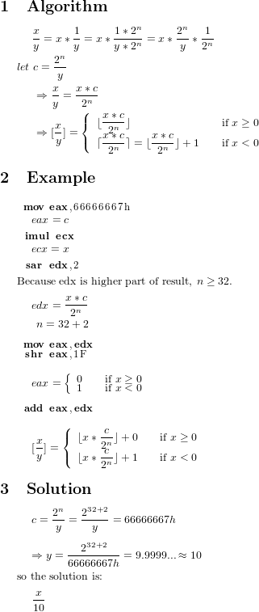

#   Getting Started

Fork and download this repository by [these steps](https://help.github.com/articles/fork-a-repo).

Open the function you want to decompile, eg: `attack_process`

    cd lf2
    vim attack_process.rb

Push to github to contribute your work if you want.

#   x86 instructions

##  Float number comparison

    fcom source

*   ST(0) > source, C3: 0, C2: 0, C0: 0
*   ST(0) = source, C3: 1, C2: 0, C0: 0
*   ST(0) < source, C3: 0, C2: 0, C0: 1

Jump if ST(0) < source

    fcom source
    fstsw ax
    test ah,5 (C2 and C0)
    jpo short 0042EFB1

Jump if ST(0) <= source

    fcom source
    fstsw ax
    test ah,41 (C3 and C0)
    jnz short 0042F008

Jump if ST(0) > source

    fcom source
    fstsw ax
    test ah,41 (C3 and C0)
    je short 0042EFC6

or

    fcom source
    fstsw ax
    test ah,41 (C3 and C0)
    jpe short 0042F251

Jump if ST(0) >= source

    fcomp source
    fstsw ax
    test ah,5 (C2 and C0)
    jpe short 0042EE20

or

    fcom source
    fstsw ax
    test ah,1 (C0)
    je short 0042F248

##  Divide constant

